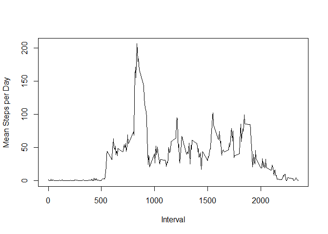
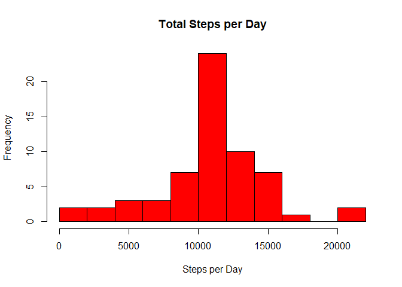
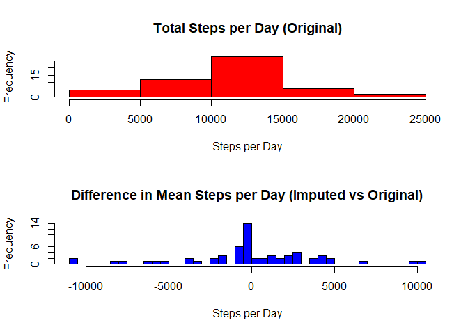
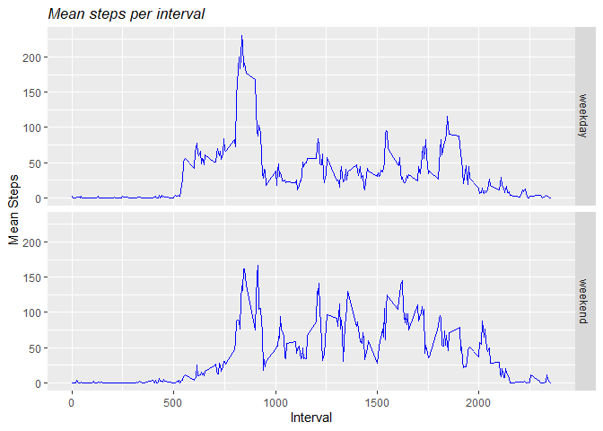

1. Loading and preprocessing the data


```r
##Downloading dataset
fileUrl<-"https://d396qusza40orc.cloudfront.net/repdata%2Fdata%2Factivity.zip"
download.file(fileUrl, destfile="./repdataset.zip",method="curl")
##unzipping compressed file, reading data
library(ggplot2)
library(dplyr)
```

```
## 
## Attaching package: 'dplyr'
```

```
## The following objects are masked from 'package:stats':
## 
##     filter, lag
```

```
## The following objects are masked from 'package:base':
## 
##     intersect, setdiff, setequal, union
```

```r
unzip("repdataset.zip")
activity<-read.csv("activity.csv")
##setup dates in "date format"
activity$date<-as.Date(activity$date)
activity$steps<-as.numeric(as.character(activity$steps),na.rm=TRUE)
activity$interval<-as.numeric(as.character(activity$interval))
```

2.What is mean total number of steps taken per day?

A.Calculate the total number of steps taken per day


```r
##calculating sum of steps per day, mean and median
steps_day<-aggregate(activity$steps ~ activity$date, FUN=sum,na.rm=TRUE )
steps_day<-rename(steps_day, date = "activity$date", steps = "activity$steps")
head(steps_day, n=10)
```

```
##          date steps
## 1  2012-10-02   126
## 2  2012-10-03 11352
## 3  2012-10-04 12116
## 4  2012-10-05 13294
## 5  2012-10-06 15420
## 6  2012-10-07 11015
## 7  2012-10-09 12811
## 8  2012-10-10  9900
## 9  2012-10-11 10304
## 10 2012-10-12 17382
```

```r
tail(steps_day, n=10)
```

```
##          date steps
## 44 2012-11-20  4472
## 45 2012-11-21 12787
## 46 2012-11-22 20427
## 47 2012-11-23 21194
## 48 2012-11-24 14478
## 49 2012-11-25 11834
## 50 2012-11-26 11162
## 51 2012-11-27 13646
## 52 2012-11-28 10183
## 53 2012-11-29  7047
```

B. Make a histogram of the total number of steps taken each day


```r
stepsplot<-steps_day$steps
hist(stepsplot,breaks=7, col = "red", main = "Total Steps per Day", xlab= "Steps per Day", )
```

<!-- -->

C. Calculate and report the mean and median of the total number of steps taken per day

```r
mean(stepsplot)
```

```
## [1] 10766.19
```

```r
median(stepsplot)
```

```
## [1] 10765
```

3. What is the average daily activity pattern?

A. Make a time series plot of the 5-minute interval (x-axis) and the average number of steps taken, averaged across all days (y-axis)


```r
stepsbyinterval<- aggregate(activity$steps~activity$interval,FUN=mean,na.rm=TRUE)
intervalsteps<-rename(stepsbyinterval, interval = "activity$interval", steps = "activity$steps")
plot(intervalsteps$interval, intervalsteps$steps, type="l", xlab="Interval",ylab = "Mean Steps per Day")
```

<!-- -->

B. Which 5-minute interval, on average across all the days in the dataset, contains the maximum number of steps?

```r
filter(intervalsteps,steps==max(steps))
```

```
##   interval    steps
## 1      835 206.1698
```

4. Imputing missing values

A. Calculate and report the total number of missing values in the dataset


```r
orig_rows<-nrow(activity)
orig_ex_NAs<-sum(complete.cases(activity))
rows_with_NAs<-orig_rows-orig_ex_NAs
```


```r
orig_rows
```

```
## [1] 17568
```

```r
orig_ex_NAs
```

```
## [1] 15264
```

```r
rows_with_NAs
```

```
## [1] 2304
```


B. Devise a strategy for filling in all of the missing values in the dataset. The strategy does not need to be sophisticated. For example, you could use the mean/median for that day, or the mean for that 5-minute interval, etc.

My strategy was  to identify the NAs in the original activity dataset and then replace or "overwrite" these with the means of the corresponding intervals (via the "match" function).  


```r
activity$steps[which(is.na(activity$steps))]<-intervalsteps$steps[match(activity$interval, intervalsteps$interval)]
```

```
## Warning in activity$steps[which(is.na(activity$steps))] <-
## intervalsteps$steps[match(activity$interval, : number of items to replace is not
## a multiple of replacement length
```

```r
head(activity,10)
```

```
##        steps       date interval
## 1  1.7169811 2012-10-01        0
## 2  0.3396226 2012-10-01        5
## 3  0.1320755 2012-10-01       10
## 4  0.1509434 2012-10-01       15
## 5  0.0754717 2012-10-01       20
## 6  2.0943396 2012-10-01       25
## 7  0.5283019 2012-10-01       30
## 8  0.8679245 2012-10-01       35
## 9  0.0000000 2012-10-01       40
## 10 1.4716981 2012-10-01       45
```

C. Create a new dataset that is equal to the original dataset but with the missing data filled in.

Given the strategy of identifying and then "over-writing" NAs, the new dataset was formed via the simple assignment of replacement values the original "activity" dataset


```r
newactivity<-activity
```

D.Make a histogram of the total number of steps taken each day and 

Calculate and report the mean and median total number of steps taken per day. Do these values differ from the estimates from the first part of the assignment? What is the impact of imputing missing data on the estimates of the total daily number of steps?


```r
newsteps_day<-aggregate(newactivity$steps ~ newactivity$date, FUN=sum,na.rm=TRUE )
newsteps_day<-rename(newsteps_day, date = "newactivity$date", steps = "newactivity$steps")
newstepsplot<-newsteps_day$steps
hist(newstepsplot, col = "red", main = "Total Steps per Day", xlab= "Steps per Day", breaks=10)
```

<!-- -->

5. Are there differences in activity patterns between weekdays and weekends?

A. Create a new factor variable in the dataset with two levels – “weekday” and “weekend” indicating whether a given date is a weekday or weekend day.


```r
newactivity$day<-weekdays(newactivity$date)
newactivity$typeofday <-ifelse(newactivity$day=="Sunday" | newactivity$day== "Saturday" , "weekend","weekday")
byintervals<-aggregate(newactivity$steps ~ newactivity$interval + newactivity$typeofday, FUN=mean,na.rm=TRUE )
byintervals$`newactivity$typeofday`<-as.factor(byintervals$`newactivity$typeofday`)
byintervals<-rename(byintervals, interval = "newactivity$interval", typeofday= "newactivity$typeofday", steps = "newactivity$steps")
head(byintervals, n=10)
```

```
##    interval typeofday      steps
## 1         0   weekday 2.25115304
## 2         5   weekday 0.44528302
## 3        10   weekday 0.17316562
## 4        15   weekday 0.19790356
## 5        20   weekday 0.09895178
## 6        25   weekday 1.59035639
## 7        30   weekday 0.69266247
## 8        35   weekday 1.13794549
## 9        40   weekday 0.00000000
## 10       45   weekday 1.79622642
```
Based on summary statistics on the differences between means of the dataset with imputed values (the "new vector") and that of the original dataset (the "original vector", specifically the mean and median differences,  the inclusion of imputed values seem unlikely to have made a material difference.  

Note that it was necessary to subtract the daily means of the new vector, not from the corresponding daily means of the original vector, but from the mean of the original vecttor's daily means. This was because the two vectors had different lengths--61 daily means for the new and 53 daily means for the old (due to the omission of NAs).

Furthermore, the distribution of mean differences broadly mirrors that of the histogram of the original dataset


```r
par(mfrow=c(2,1))
hist(stepsplot,breaks=7, col = "red", main = "Total Steps per Day (Original)", xlab= "Steps per Day", )
difference_in_steps<-newstepsplot-mean(stepsplot)
hist(difference_in_steps, col = "blue", main = "Difference in Mean Steps per Day (Imputed vs Original)", xlab= "Steps per Day", breaks=45)
```

<!-- -->

```r
summary(difference_in_steps)
```

```
##     Min.  1st Qu.   Median     Mean  3rd Qu.     Max. 
## -10725.2   -947.2      0.0      0.0   2044.8  10427.8
```

B. Make a panel plot containing a time series plot of the 5-minute interval (x-axis) and the average number of steps taken, averaged across all weekday days or weekend days (y-axis). 


```r
k <- ggplot(byintervals, aes(x=interval,y=steps))
k+geom_line(color="blue")+ggtitle("Mean steps per interval")+xlab("Interval")+ylab("Mean Steps")+theme(plot.title = element_text(size=13, face="italic", ))+ facet_grid(typeofday ~ .)
```

<!-- -->


By inspection, the daily mean steps per interval appear to be higher on average for intervals >1000. Between intervals 500 and 1000, however, weekday mean daily steps by interval seem higher.
